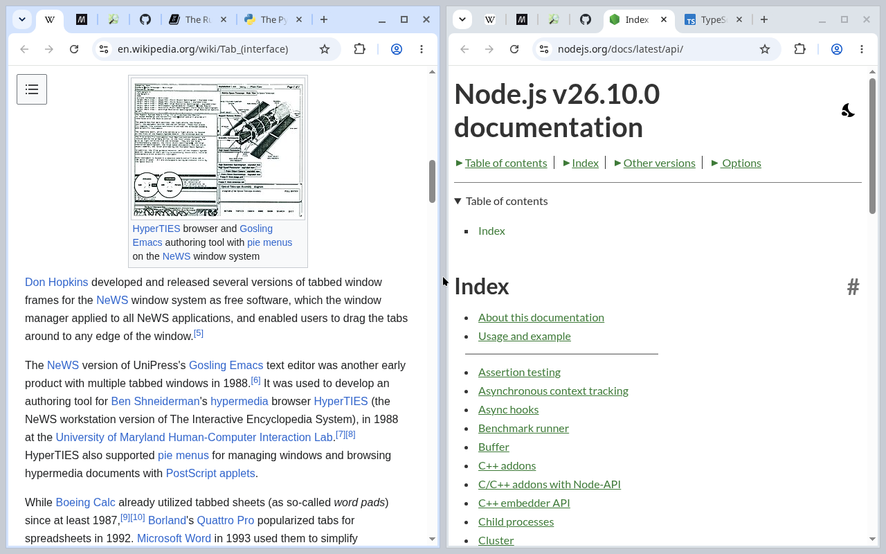

# Synced Pins

A Chrome extension that gives every window the same pinned tabs, like Essentials in the Zen browser.

Each pinned tab is open in one window. Your other windows show it in the same place, with its icon, and selecting it there brings the page over as it is: nothing reloads, a video keeps playing, a half-typed message stays. Switching to a window that shows a pinned tab brings the page back there too. A window showing one of its own tabs takes nothing, so a pinned tab can keep running in one window while you work in another.



## Install

From the [Releases](https://github.com/nanbiz/synced-pins/releases) page: unzip `synced-pins-<version>.zip`, open `chrome://extensions`, turn on Developer mode, click **Load unpacked** and pick the unzipped folder. It is built for Chromium-based browsers and tested in Chromium 149 and Helium 0.16.

## How it behaves

- Pin a tab in any window and it shows up pinned in all of them. Unpinning, closing and reordering pinned tabs work the same way from any window.
- In a window where a pinned tab is not open, its place holds a stand-in page with the tab's icon and title. That is what a window shows when the tab it was showing is pulled into another window.
- Close the window a pinned tab is open in and the tab opens again in the window you used last, at the same address.
- Popups, installed web apps and incognito windows are left alone.

## Permissions

`tabs` lets the extension read the address, title and icon of your pinned tabs, which it needs to draw them in your other windows. Chrome describes this permission as "Read your browsing history". `storage` keeps the list of pinned tabs while the browser runs. Nothing is sent anywhere; see [PRIVACY.md](PRIVACY.md).

## Develop

There are no dependencies. The tests launch a real Chromium with the extension loaded, on a private Xvfb display, and drive it over the DevTools protocol:

```
sh scripts/test-e2e.sh                     # needs chromium and xvfb-run on PATH
CHROME_PATH=/path/to/browser sh scripts/test-e2e.sh
node scripts/package.js                    # dist/synced-pins-<version>.zip
```

Headless Chromium fires no focus events, which is why the suite runs headed.

## License

MIT
